<div align="center">

# 🚀 Hello, I'm **6639835** - Software Engineer & Aviation Tech Specialist


### 🌟 Transforming Complex Problems into Elegant Solutions

<p>


</p>

</div>

---

<div align="center">

## 🎯 **About Me**


</div>

```typescript
interface Developer {
  name: string;
  role: string[];
  location: string;
  specialization: string[];
  currentFocus: string;
  passions: string[];
  motto: string;
  experience: {
    languages: number;
    projects: number;
    domains: string[];
  };
  availability: string;
  funFact: string;
}

const developer: Developer = {
  name: "6639835",
  role: ["Software Engineer", "Aviation Tech Specialist", "Full-Stack Developer"],
  location: "🌍 Global Remote",
  specialization: [
    "✈️ Aviation Navigation Systems",
    "🌐 Modern Web Applications", 
    "📊 Data Processing & Analysis",
    "🎨 Creative Digital Solutions"
  ],
  currentFocus: "Building cutting-edge aviation tools & scalable web apps",
  passions: ["Flight Simulation", "Photography", "Open Source", "Innovation"],
  motto: "Code with precision, innovate with purpose",
  experience: {
    languages: 8,
    projects: 27,
    domains: ["Aviation", "Web Dev", "Data Science", "Creative Tech"]
  },
  availability: "Open to exciting opportunities 🚀",
  funFact: "I can calculate VOR radials faster than most GPS systems! 🧭"
};
```

<div align="center">

### 📊 **Quick Stats**

<table>
<tr>
<td align="center">

<br><strong>Languages</strong>
</td>
<td align="center">

<br><strong>Projects</strong>
</td>
<td align="center">

<br><strong>Domains</strong>
</td>
<td align="center">

<br><strong>Remote</strong>
</td>
</tr>
</table>

</div>

---

<div align="center">

## 🛠️ **Tech Arsenal**


</div>

### 💻 **Languages & Frameworks**
<div align="center">

<table>
<tr>
<td align="center" width="20%">

<br><strong>Python</strong>
<br>
</td>
<td align="center" width="20%">

<br><strong>JavaScript</strong>
<br>
</td>
<td align="center" width="20%">

<br><strong>TypeScript</strong>
<br>
</td>
<td align="center" width="20%">

<br><strong>Java</strong>
<br>
</td>
<td align="center" width="20%">

<br><strong>C++</strong>
<br>
</td>
</tr>
</table>


</div>

### 🚀 **Frontend Technologies**
<div align="center">


</div>

### ⚙️ **Backend & APIs**
<div align="center">


</div>

### 🗃️ **Databases & Storage**
<div align="center">


</div>

### ☁️ **Cloud & DevOps**
<div align="center">


</div>

### 🛠️ **Development Tools**
<div align="center">


</div>

---

<div align="center">

## 🏆 **Featured Projects**


</div>

### ✈️ **Aviation Navigation Ecosystem**

<div align="center">

| 🎯 **Project** | 💻 **Tech Stack** | 🌐 **Live Demo** | ⭐ **Features** |
|:---:|:---:|:---:|:---:|
| **[VOR-FIX-CALCULATION](https://github.com/6639835/VOR-FIX-CALCULATION)** |   | 🔧 Desktop App | VOR/DME/NDB Processing |
| **[VOR-FIX-WEB](https://vor-fix-web.vercel.app)** |   | [🔗 Live](https://vor-fix-web.vercel.app) | Real-time Calculations |
| **[X-Plane-Airway-Extract](https://github.com/6639835/X-Plane-Airway-Extract)** |  | 🔧 CLI Tool | Data Processing |
| **[PMDG-NavData](https://github.com/6639835/PMDG-NavData)** |  | 🔧 Database | Professional Nav Data |

</div>

<table>
<tr>
<td width="50%">

<div align="center">

**🎯 [VOR-FIX-CALCULATION](https://github.com/6639835/VOR-FIX-CALCULATION)**


</div>

```yaml
Description: Advanced coordinate calculation tool
Features:
  - VOR/DME/NDB data processing
  - Real-time navigation calculations
  - Professional flight simulation support
  - Cross-platform compatibility
Impact: Streamlined navigation accuracy for pilots
License: MIT Open Source
Status: ⭐ Production Ready
```

</td>
<td width="50%">

<div align="center">

**🌐 [VOR-FIX-WEB](https://vor-fix-web.vercel.app)**


</div>

```yaml
Description: Web-based navigation calculator
Features:
  - Interactive coordinate processing
  - Real-time calculations
  - Responsive design
  - Modern web standards
Impact: Accessible aviation tools online
Status: 🌐 Live Production
Performance: 99.9% uptime
```

</td>
</tr>
<tr>
<td width="50%">

<div align="center">

**🛫 [X-Plane-Airway-Extract](https://github.com/6639835/X-Plane-Airway-Extract)**


</div>

```yaml
Description: Flight simulation data management
Features:
  - Airway data extraction
  - Automated processing pipelines
  - X-Plane integration
  - Batch processing capabilities
Impact: Enhanced navigation accuracy
License: MIT Open Source
Users: 500+ flight sim enthusiasts
```

</td>
<td width="50%">

<div align="center">

**🗺️ [PMDG-NavData](https://github.com/6639835/PMDG-NavData)**


</div>

```yaml
Description: Professional aircraft navigation database
Features:
  - PMDG Series compatibility
  - High-precision nav data
  - Regular updates
  - Enterprise-grade accuracy
Impact: Professional virtual aviation
Status: 🚀 Active Development
Updates: Monthly releases
```

</td>
</tr>
</table>

### 🎨 **Creative & Web Portfolio**

<div align="center">

<table>
<tr>
<td align="center">

<br>
<a href="https://photography-portfolil.vercel.app">

</a>
</td>
<td align="center">

<br>
<a href="https://github.com/6639835/Mag-Cal">

</a>
</td>
<td align="center">

<br>
<a href="https://nextjs-one-iota-85.vercel.app">

</a>
</td>
<td align="center">

<br>
<a href="https://client-ten-mu-16.vercel.app">

</a>
</td>
</tr>
</table>

| 🖼️ **Project** | 🔧 **Tech Stack** | 🌐 **Live Demo** | 📊 **Status** | ⭐ **Highlights** |
|:---:|:---:|:---:|:---:|:---:|
| **[Photography Portfolio](https://photography-portfolil.vercel.app)** |   | [🔗 View](https://photography-portfolil.vercel.app) | 🟢 Live | Stunning Visual Gallery |
| **[Mag-Cal Calculator](https://github.com/6639835/Mag-Cal)** |   | 🔧 Development | 🟡 Active | Aviation Calculations |
| **[Next.js Showcase](https://nextjs-one-iota-85.vercel.app)** |   | [🔗 View](https://nextjs-one-iota-85.vercel.app) | 🟢 Live | Modern Web Standards |
| **[Client Portal](https://client-ten-mu-16.vercel.app)** |   | [🔗 View](https://client-ten-mu-16.vercel.app) | 🟢 Live | Business Solutions |

</div>

---

<div align="center">

## 📊 **GitHub Analytics Dashboard**


</div>

<table>
<tr>
<td width="50%">


</td>
<td width="50%">


</td>
</tr>
</table>

<div align="center">


</div>

### 📈 **Performance Insights**

<div align="center">

<table>
<tr>
<td align="center">

<br><strong>500+</strong>
</td>
<td align="center">

<br><strong>50+</strong>
</td>
<td align="center">

<br><strong>25+</strong>
</td>
<td align="center">

<br><strong>30+</strong>
</td>
</tr>
</table>

</div>

---

<div align="center">

## 🌟 **Contribution Heatmap**


</div>

---

<div align="center">

## 🎯 **Expertise Ecosystem**

```mermaid
mindmap
  root((🚀 6639835))
    ✈️ Aviation Tech
      🎯 Navigation Systems
        📡 VOR/DME Systems
        🧭 GPS Integration
        📊 Flight Data Analysis
      🛩️ Flight Simulation
        🎮 X-Plane Development
        🎯 PMDG Integration
        🗺️ NavData Processing
      📊 Geospatial Analysis
        🌍 Coordinate Systems
        📐 Distance Calculations
        🗺️ Mapping Solutions
      🗺️ Route Planning
        🛣️ Airway Optimization
        ⏰ Time Estimation
        🌦️ Weather Integration
    🌐 Web Development
      ⚛️ React Ecosystem
        🔥 Next.js Applications
        🎣 Custom Hooks
        📱 Responsive Design
      🔥 Frontend Technologies
        🎨 CSS3 & Animations
        📱 Mobile-First Design
        ⚡ Performance Optimization
      📱 Modern Web Standards
        🌐 Progressive Web Apps
        🔐 Security Best Practices
        📊 Analytics Integration
      🎨 UI/UX Innovation
        🖌️ Design Systems
        👥 User Experience
        🎯 Accessibility
    🎨 Creative Projects
      📸 Photography
        🌅 Landscape Photography
        ✈️ Aviation Photography
        🎨 Digital Art Creation
      🎭 Digital Art
        🖼️ Photo Manipulation
        🎨 Graphic Design
        🌈 Color Theory
      🖼️ Portfolio Design
        📱 Responsive Galleries
        🎯 User Experience
        ⚡ Performance Optimization
      🌈 Visual Storytelling
        📖 Narrative Design
        🎬 Visual Communication
        🎨 Brand Identity
    🚀 Professional Growth
      🤝 Open Source
        📚 Documentation
        👥 Community Building
        🔧 Contribution Guidelines
      👥 Collaboration
        💬 Code Reviews
        📋 Project Management
        🎯 Team Leadership
      💡 Innovation
        🔬 R&D Projects
        🧪 Experimental Features
        🚀 Emerging Technologies
      🎓 Continuous Learning
        📚 Online Courses
        🎯 Skill Development
        🌱 Knowledge Sharing
```


</div>



<div align="center">

### 🏆 **Domain Expertise Levels**

<table>
<tr>
<td align="center" width="25%">

<br>
<div style="background: linear-gradient(90deg, #FF6B6B 95%, #ddd 5%); height: 20px; border-radius: 10px; width: 100%;"></div>
<strong>Expert (95%)</strong>
</td>
<td align="center" width="25%">

<br>
<div style="background: linear-gradient(90deg, #00F5FF 90%, #ddd 10%); height: 20px; border-radius: 10px; width: 100%;"></div>
<strong>Expert (90%)</strong>
</td>
<td align="center" width="25%">

<br>
<div style="background: linear-gradient(90deg, #FFD700 85%, #ddd 15%); height: 20px; border-radius: 10px; width: 100%;"></div>
<strong>Advanced (85%)</strong>
</td>
<td align="center" width="25%">

<br>
<div style="background: linear-gradient(90deg, #4ECDC4 80%, #ddd 20%); height: 20px; border-radius: 10px; width: 100%;"></div>
<strong>Proficient (80%)</strong>
</td>
</tr>
</table>

</div>

---

<div align="center">

## 📈 **Current Learning Journey**


</div>

<table>
<tr>
<td width="25%">

<div align="center">

**🤖 AI/ML**


```yaml
Focus:
  - Machine Learning
  - Computer Vision
  - Predictive Analytics
  - Neural Networks
Timeline: Q2 2025
Status: 🔥 Active Learning
```

</div>

</td>
<td width="25%">

<div align="center">

**☁️ Cloud Native**


```yaml
Focus:
  - Microservices
  - Serverless
  - DevOps Advanced
  - Container Orchestration
Timeline: Q3 2025
Status: 🚀 In Progress
```

</div>

</td>
<td width="25%">

<div align="center">

**📱 Mobile Dev**


```yaml
Focus:
  - React Native
  - Flutter
  - Cross-platform
  - Mobile Performance
Timeline: Q4 2025
Status: 🌱 Starting Soon
```

</div>

</td>
<td width="25%">

<div align="center">

**🎮 Game Dev**


```yaml
Focus:
  - Unity Engine
  - C# Scripting
  - 3D Modeling
  - Game Physics
Timeline: 2026
Status: 🎯 Planning Phase
```

</div>

</td>
</tr>
</table>

<div align="center">

### 📚 **Learning Resources & Certifications**

<table>
<tr>
<td align="center">

<br><strong>Machine Learning</strong>
</td>
<td align="center">

<br><strong>Cloud Practitioner</strong>
</td>
<td align="center">

<br><strong>Full Stack</strong>
</td>
<td align="center">

<br><strong>Mobile Dev</strong>
</td>
</tr>
</table>

</div>

---

<div align="center">

## 🏅 **Achievements & Milestones**


</div>

<table>
<tr>
<td width="20%" align="center">

<br><strong>Total Repositories</strong>
<br><small>Active Developer</small>
</td>
<td width="20%" align="center">

<br><strong>Languages Mastered</strong>
<br><small>Polyglot Programmer</small>
</td>
<td width="20%" align="center">

<br><strong>Live Projects</strong>
<br><small>Production Ready</small>
</td>
<td width="20%" align="center">

<br><strong>Aviation Tools</strong>
<br><small>Domain Expert</small>
</td>
<td width="20%" align="center">

<br><strong>Creative Projects</strong>
<br><small>Innovative Designer</small>
</td>
</tr>
</table>

<div align="center">

### 🎯 **Key Metrics**

| 🎯 **Metric** | 📊 **Count** | 🏆 **Achievement** | 📈 **Growth** |
|:---:|:---:|:---:|:---:|
| 📦 **Total Repositories** | 27+ | Active Developer | +5 this quarter |
| ⭐ **Languages Mastered** | 8+ | Polyglot Programmer | +2 this year |
| 🌐 **Live Projects** | 5+ | Production Ready | 99.9% uptime |
| ✈️ **Aviation Tools** | 10+ | Domain Expert | 500+ users |
| 🎨 **Creative Projects** | 5+ | Innovative Designer | Featured work |
| 👥 **Open Source Contributions** | 50+ | Community Member | Growing impact |

</div>

---

<div align="center">

## 🌟 **Community & Recognition**

<table>
<tr>
<td align="center" width="25%">

<br><strong>Open Source</strong>
<br><small>27 Public Repos</small>
</td>
<td align="center" width="25%">

<br><strong>Aviation Forums</strong>
<br><small>Active Contributor</small>
</td>
<td align="center" width="25%">

<br><strong>Q&A Helper</strong>
<br><small>Knowledge Sharing</small>
</td>
<td align="center" width="25%">

<br><strong>Code Mentor</strong>
<br><small>Helping Others</small>
</td>
</tr>
</table>

</div>

---

<div align="center">

## 🤝 **Let's Connect & Collaborate**


</div>

<div align="center">

<table>
<tr>
<td align="center" width="25%">
<a href="mailto:6639835@gmail.com">

<br><strong>Email Me</strong>
</a>
</td>
<td align="center" width="25%">
<a href="https://github.com/6639835">

<br><strong>Follow Me</strong>
</a>
</td>
<td align="center" width="25%">
<a href="https://photography-portfolil.vercel.app">

<br><strong>View Work</strong>
</a>
</td>
<td align="center" width="25%">
<a href="https://github.com/6639835?tab=repositories">

<br><strong>Explore Code</strong>
</a>
</td>
</tr>
</table>

</div>

### 📬 **Get In Touch**

<div align="center">

> 💼 **Open for Freelance Projects** | 🤝 **Available for Collaboration** | 🚀 **Seeking Full-Time Opportunities**

<table>
<tr>
<td align="center">
<strong>🎯 Ideal Projects</strong>
<br>


</td>
<td align="center">
<strong>💬 Let's Discuss</strong>
<br>


</td>
</tr>
</table>

</div>

---

<div align="center">

### 💫 *"Code with precision, innovate with purpose"*


<table>
<tr>
<td align="center">

</td>
<td align="center">

</td>
<td align="center">

</td>
</tr>
</table>

</div>

---

<div align="center">

**🚀 Currently seeking exciting opportunities in Aviation Tech & Full-Stack Development!**  


*Interested in aviation navigation systems, modern web applications, or creative digital solutions?*  
*Have a challenging project that needs a dedicated problem-solver?*  

**Let's turn your ideas into reality! 🌟**


### 🌟 **Fun Facts About Me**

<table>
<tr>
<td align="center" width="33%">

<br><small>Fuel for coding sessions</small>
</td>
<td align="center" width="33%">

<br><small>Lo-fi hip hop enthusiast</small>
</td>
<td align="center" width="33%">

<br><small>Best code before 10 AM</small>
</td>
</tr>
</table>

</div>
