<div align="center">

# 🚀 Hello, I'm **6639835** - Software Engineer & Aviation Tech Specialist


### 🌟 Transforming Complex Problems into Elegant Solutions

</div>

---

## 🎯 **About Me**


```typescript
interface Developer {
  name: string;
  role: string[];
  location: string;
  specialization: string[];
  currentFocus: string;
  passions: string[];
  motto: string;
  experience: {
    languages: number;
    projects: number;
    domains: string[];
  };
}

const developer: Developer = {
  name: "6639835",
  role: ["Software Engineer", "Aviation Tech Specialist", "Full-Stack Developer"],
  location: "🌍 Global Remote",
  specialization: [
    "✈️ Aviation Navigation Systems",
    "🌐 Modern Web Applications", 
    "📊 Data Processing & Analysis",
    "🎨 Creative Digital Solutions"
  ],
  currentFocus: "Building cutting-edge aviation tools & scalable web apps",
  passions: ["Flight Simulation", "Photography", "Open Source", "Innovation"],
  motto: "Code with precision, innovate with purpose",
  experience: {
    languages: 8,
    projects: 27,
    domains: ["Aviation", "Web Dev", "Data Science", "Creative Tech"]
  }
};
```

---

<div align="center">

## 🛠️ **Tech Arsenal**


</div>

### 💻 **Languages & Frameworks**
<div align="center">


</div>

### 🗃️ **Databases & Cloud**
<div align="center">


</div>

---

<div align="center">

## 🏆 **Featured Projects**


</div>

### ✈️ **Aviation Navigation Ecosystem**

<table>
<tr>
<td width="50%">

<div align="center">

**🎯 [VOR-FIX-CALCULATION](https://github.com/6639835/VOR-FIX-CALCULATION)**


</div>

```yaml
Description: Advanced coordinate calculation tool
Features:
  - VOR/DME/NDB data processing
  - Real-time navigation calculations
  - Professional flight simulation support
Impact: Streamlined navigation accuracy
License: MIT
```

</td>
<td width="50%">

<div align="center">

**🌐 [VOR-FIX-WEB](https://vor-fix-web.vercel.app)**


</div>

```yaml
Description: Web-based navigation calculator
Features:
  - Interactive coordinate processing
  - Real-time calculations
  - Responsive design
Impact: Accessible aviation tools online
Status: Live Production
```

</td>
</tr>
<tr>
<td width="50%">

<div align="center">

**🛫 [X-Plane-Airway-Extract](https://github.com/6639835/X-Plane-Airway-Extract)**


</div>

```yaml
Description: Flight simulation data management
Features:
  - Airway data extraction
  - Automated processing pipelines
  - X-Plane integration
Impact: Enhanced navigation accuracy
License: MIT
```

</td>
<td width="50%">

<div align="center">

**🗺️ [PMDG-NavData](https://github.com/6639835/PMDG-NavData)**


</div>

```yaml
Description: Professional aircraft navigation database
Features:
  - PMDG Series compatibility
  - High-precision nav data
  - Regular updates
Impact: Professional virtual aviation
Status: Active Development
```

</td>
</tr>
</table>

### 🎨 **Creative & Web Portfolio**

<div align="center">

| 🖼️ **Project** | 🔧 **Tech Stack** | 🌐 **Live Demo** | 📊 **Status** |
|:---:|:---:|:---:|:---:|
| **[Photography Portfolio](https://photography-portfolil.vercel.app)** |  | [🔗 View](https://photography-portfolil.vercel.app) | 🟢 Live |
| **[Mag-Cal Calculator](https://github.com/6639835/Mag-Cal)** |  | 🔧 Development | 🟡 Active |
| **[Next.js Showcase](https://nextjs-one-iota-85.vercel.app)** |  | [🔗 View](https://nextjs-one-iota-85.vercel.app) | 🟢 Live |
| **[Client Portal](https://client-ten-mu-16.vercel.app)** |  | [🔗 View](https://client-ten-mu-16.vercel.app) | 🟢 Live |

</div>

---

<div align="center">

## 📊 **GitHub Analytics Dashboard**


<table>
<tr>
<td width="50%">


</td>
<td width="50%">


</td>
</tr>
</table>


</div>

---

<div align="center">

## 🌟 **Contribution Heatmap**


</div>

---

<div align="center">

## 🎯 **Expertise Ecosystem**

```mermaid
mindmap
  root((🚀 6639835))
    ✈️ Aviation Tech
      🎯 Navigation Systems
      🛩️ Flight Simulation
      📊 Geospatial Analysis
      🗺️ Route Planning
    🌐 Web Development
      ⚛️ React Ecosystem
      🔥 Next.js Apps
      📱 Responsive Design
      🎨 UI/UX Innovation
    🎨 Creative Projects
      📸 Photography
      🎭 Digital Art
      🖼️ Portfolio Design
      🌈 Visual Storytelling
    🚀 Professional Growth
      🤝 Open Source
      👥 Collaboration
      💡 Innovation
      🎓 Continuous Learning
```



</div>

---

<div align="center">

## 📈 **Current Learning Journey**


</div>

<table>
<tr>
<td width="25%">

<div align="center">

**🤖 AI/ML**
```yaml
Focus:
  - Machine Learning
  - Computer Vision
  - Predictive Analytics
Timeline: Q2 2025
```

</div>

</td>
<td width="25%">

<div align="center">

**☁️ Cloud Native**
```yaml
Focus:
  - Microservices
  - Serverless
  - DevOps Advanced
Timeline: Q3 2025
```

</div>

</td>
<td width="25%">

<div align="center">

**📱 Mobile Dev**
```yaml
Focus:
  - React Native
  - Flutter
  - Cross-platform
Timeline: Q4 2025
```

</div>

</td>
<td width="25%">

<div align="center">

**🎮 Game Dev**
```yaml
Focus:
  - Unity Engine
  - C# Scripting
  - 3D Modeling
Timeline: 2026
```

</div>

</td>
</tr>
</table>

---

<div align="center">

## 🏅 **Achievements & Milestones**


| 🎯 **Metric** | 📊 **Count** | 🏆 **Achievement** |
|:---:|:---:|:---:|
| 📦 **Total Repositories** | 27+ | Active Developer |
| ⭐ **Languages Mastered** | 8+ | Polyglot Programmer |
| 🌐 **Live Projects** | 5+ | Production Ready |
| ✈️ **Aviation Tools** | 10+ | Domain Expert |
| 🎨 **Creative Projects** | 5+ | Innovative Designer |

</div>

---

<div align="center">

## 🤝 **Let's Connect & Collaborate**


[](mailto:6639835@gmail.com)
[](https://github.com/6639835)
[](https://photography-portfolil.vercel.app)
[](https://github.com/6639835?tab=repositories)

</div>

---

<div align="center">

### 💫 *"Code with precision, innovate with purpose"*


</div>

---

<div align="center">

**🚀 Currently seeking exciting opportunities in Aviation Tech & Full-Stack Development!**  

*Interested in aviation navigation systems, modern web applications, or creative digital solutions?*  
*Have a challenging project that needs a dedicated problem-solver?*  

**Let's turn your ideas into reality! 🌟**


</div>
